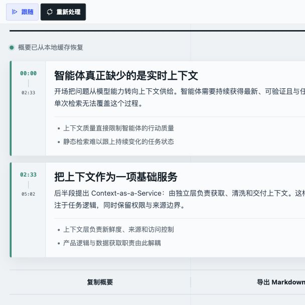

<div align="center">

# video-parallel

### Watch the video. Read the structure.

Turn YouTube and Bilibili captions into a full-video overview and semantic AI chapter summaries that stay in sync with playback.

[](https://github.com/fancive/video-parallel/releases/latest) [](https://github.com/fancive/video-parallel/actions/workflows/ci.yml) [](#requirements) [](public/manifest.json) [](PRIVACY.md) [](LICENSE)

[Install from latest release](#install-from-github-release) · [Build from source](#build-from-source) · [How it works](#how-it-works) · [Privacy](PRIVACY.md)

</div>

<p align="center">
  
</p>

<p align="center"><sub>The real Side Panel UI, rendered with the bundled preview data.</sub></p>

## Why video-parallel?

| Overview + semantic chapters | Playback-aware reading | Bring your own provider |
| --- | --- | --- |
| Start with the video's main conclusions, then follow topic, argument, and narrative transitions instead of fixed intervals. | The active chapter follows playback, and every timestamp is a seek target. | Use OpenAI, Anthropic, Gemini, DeepSeek, OpenRouter, Ollama, or another supported endpoint without a developer-operated backend. |

The extension reads caption tracks already available on YouTube and Bilibili. It does not upload
audio or depend on a transcript proxy. The complete transcript is sent to your configured provider
only when you explicitly click **Process video**.

## Install from GitHub Release

The release zip is a ready-to-use extension package:

1. Open the [latest release](https://github.com/fancive/video-parallel/releases/latest).
2. Download the `video-parallel-v*.zip` asset.
3. Open `chrome://extensions` and enable **Developer mode**.
4. Drag the downloaded zip onto the extensions page.

If drag-and-drop is unavailable in your browser, unzip the package, click **Load unpacked**, and
select the extracted directory.

## Build from source

```bash
git clone https://github.com/fancive/video-parallel.git
cd video-parallel
npm install
npm run build
```

Then load the generated build:

1. Open `chrome://extensions`.
2. Enable **Developer mode**.
3. Click **Load unpacked** and select the generated `dist/` directory.
4. Open the extension settings, choose a Provider, and add its API Key. Click **Fetch available
   models**, choose one from the Model dropdown, or enter a Model ID manually; then use **Test
   connection** before saving.
5. Visit a standard YouTube `watch` page or Bilibili `/video/BV...` page with captions, then click
   **Summary** in the video action bar.

Bilibili exposes caption-track URLs only to signed-in viewers. Sign in to Bilibili in the same
browser profile before reading a Bilibili video; the extension uses that existing page session but
does not read or store cookie values.

For a local Ollama server, use `http://localhost:11434/v1` and leave the API Key empty.

## What you get

- A full-video overview followed by a title, concise summary, key points, and clickable time range
  for every semantic chapter.
- Automatic active-chapter highlighting and scrolling during playback.
- Small, standard, and large Side Panel reading sizes independent of the video page zoom.
- Full-video takeaways and chapter summaries consistently written in the selected output language:
  Simplified Chinese, Traditional Chinese, Japanese, Korean, English, French, German, or Spanish.
- Separate caches by video, language, endpoint, model, and prompt version.
- One-click copy and Markdown export with timestamps.
- No developer-operated backend, analytics, advertising, or telemetry.

## How it works

```text
YouTube or Bilibili caption track
        ↓
Complete transcript + stable segment IDs + timestamps
        ↓
Target-language conversion + semantic chaptering + summarization
        ↓
Seekable chapter cards + local cache + Markdown
```

The extension accepts only model-selected chapter boundaries that correspond to real caption
segments. It then produces continuous, non-overlapping chapters covering the complete video.

> [!NOTE]
> A single processing request is currently limited to 2,000 caption segments or 100,000 characters.
> Videos above either limit fail explicitly instead of silently falling back to mechanical chunking.

## Providers and models

The settings page includes 11 presets across three request protocols, plus a Custom connection.
Preset model names are suggestions rather than a fixed allowlist. **Fetch available models** reads
the current account's model endpoint and puts the returned IDs in a real Model dropdown. Selecting
one synchronizes the editable Model ID field, which continues to accept any manually entered ID.

| Protocol | Built-in Provider presets | Model discovery |
| --- | --- | --- |
| OpenAI-compatible | DeepSeek, OpenAI, xAI, Mistral, OpenRouter, Groq, Together AI, Cerebras | `GET /models` |
| Anthropic Messages | Anthropic | `GET /v1/models` |
| Gemini GenerateContent | Google Gemini | `GET /v1beta/models` |
| OpenAI-compatible local | Ollama or another local server | `GET /models`; API Key optional |
| Custom | Any HTTPS endpoint using one of the three protocols | Standard model-list endpoint for the selected protocol |

Every preset supplies a default Base URL and a short model suggestion list. The extension still
uses the live model-list response and a small **Test connection** generation request as the useful
availability checks; a catalog entry alone does not guarantee that a model is enabled for an
account. The test request may incur a minimal Provider charge.

Non-local endpoints must use HTTPS. Saving settings requests optional host access only for the
configured origin.

## Privacy by design

> [!IMPORTANT]
> The complete transcript and video title are sent directly to the AI Provider you configure.
> Provider settings, API Keys, and summary caches stay in `chrome.storage.local`, but Chrome local
> storage is not an encrypted password vault. Use a dedicated Key with a spending limit.

Permissions are deliberately scoped:

- YouTube and Bilibili host access reads video metadata, caption tracks, and playback time on their
  standard video pages.
- `sidePanel` displays the chapter-summary workspace.
- `storage` keeps settings, Keys, and summary caches locally.
- `tabs` and `scripting` read player state and seek playback in the target video tab.
- AI endpoint access is optional and requested for the configured origin when settings are saved.

Read the complete [Privacy Policy](PRIVACY.md) and [Security Policy](SECURITY.md) before processing
private, confidential, or regulated material.

## Keyboard shortcuts

| Shortcut | Action |
| --- | --- |
| macOS `Option+Shift+9` | Open or close the summary Side Panel |
| Other platforms `Alt+Shift+P` | Open or close the summary Side Panel |
| `Alt+Shift+S` | Open the Side Panel and process the current video |

Shortcuts can be customized at `chrome://extensions/shortcuts`.

## Requirements

- Chrome 116 or later.
- A standard `youtube.com/watch` or `bilibili.com/video/BV...` page with a readable native or
  automatically generated caption track.
- A signed-in Bilibili session when processing Bilibili captions.
- A supported AI endpoint: OpenAI-compatible `/chat/completions`, Anthropic `/messages`, or Gemini
  `generateContent`. Models that cannot reliably return the requested JSON summary are rejected.

YouTube Shorts, live streams, Bilibili bangumi pages, local ASR, and audio-upload transcription are
not currently supported. Chrome Web Store installation and automatic updates are not available yet.

## Development

```bash
npm run typecheck
npm run lint
npm test
npm run build
npm run check
npm run package
```

`npm run package` creates `release/video-parallel-v<version>.zip`.

## CI and releases

- **CI** runs `npm ci` and the complete package gate on pushes to `main`, pull requests, and manual
  dispatches. Successful runs retain the extension zip as a workflow artifact for 14 days.
- **Release** validates that the tag, `package.json`, and Chrome Manifest versions match, reruns the
  complete package gate, then creates a GitHub Release and uploads the installable zip.
- Pushing a `v*` tag publishes automatically. Existing tags can be published through the Release
  workflow's manual `tag` input.

## Roadmap

- Add hierarchical model-driven chaptering for long videos.
- Reuse native video chapters and allow manual adjustment of model-selected boundaries.
- Add real YouTube and Bilibili end-to-end coverage with Playwright and Chrome extension mode.
- Publish a Chrome Web Store release with automatic updates.

## License

[MIT](LICENSE)
