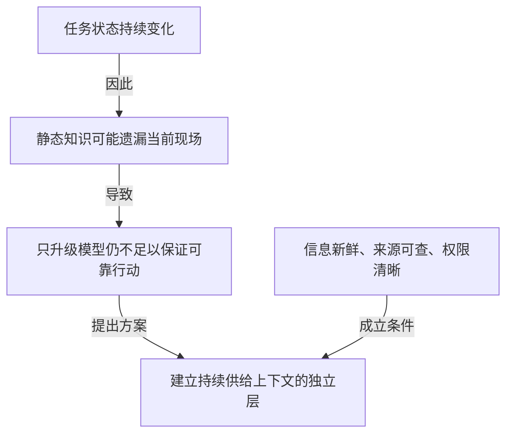
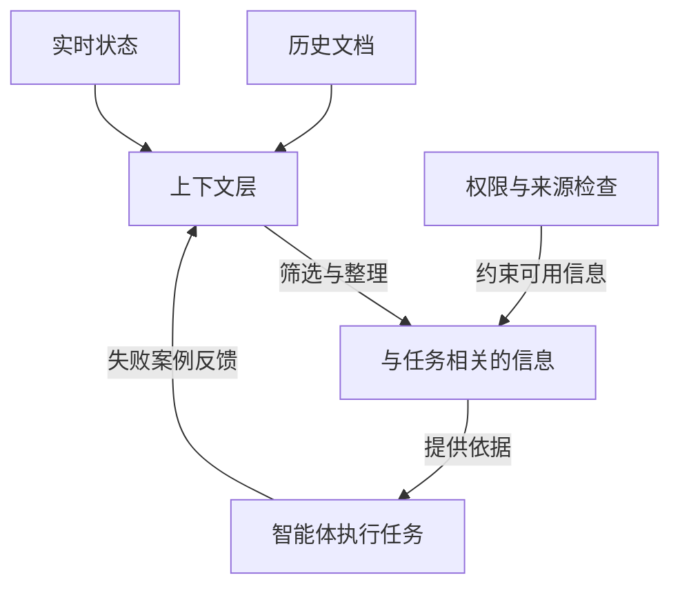
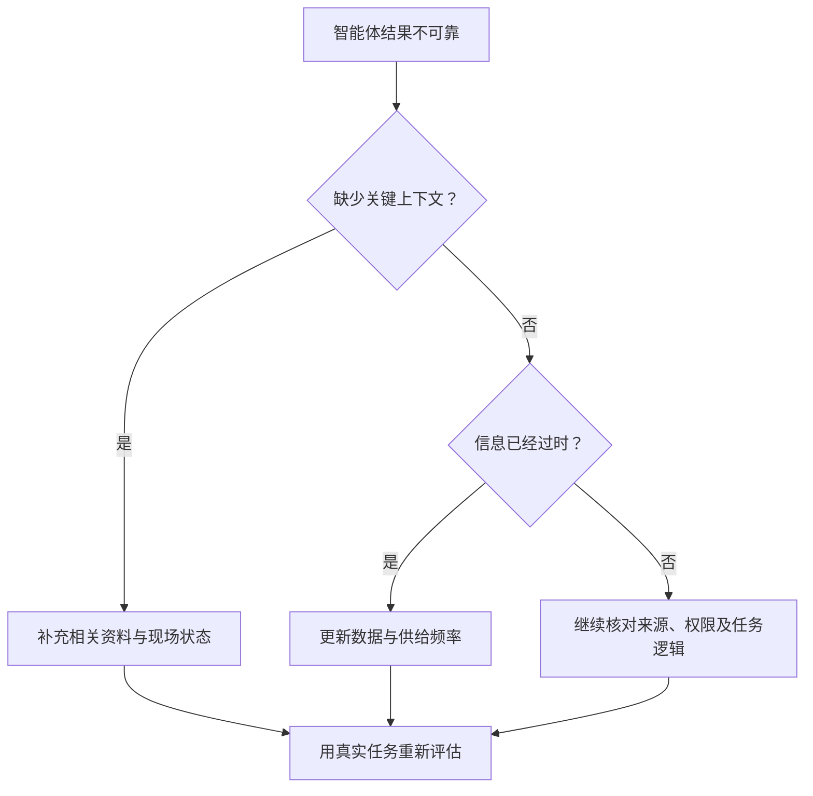

# 长视频阅读：主要贡献与章节摘要

状态：主要贡献方案已实现，通过自动化检查与默认布局预览验收。更新：2026-09-27。

## 目标与场景

长视频的章节摘要仍需大量阅读，原全文架构图又直接复用章节标题和要点，用户认为重复。默认结果应回答“这段内容最有价值的贡献是什么”，章节摘要保留内容覆盖与回看定位。

## 已确认范围

- 简短结论后默认展示 1–3 项主要贡献，从全文选择，不逐章凑数，也不把章节要点改名为贡献。
- 每项说明提出了什么、解决什么问题、价值在哪里；有原文支持的适用边界可按需展开。
- 贡献可以是解释视角、方法、证据、知识整合或实践经验。单凭视频不宣称领域首创，不编造比较基线，也不添加外部知识或个人建议。
- 没有明确贡献时返回空列表并解释原因，不要求所有视频都产出三项。
- 每项保留 1–3 处真实字幕依据，可点击时间回看。字幕位置有效只证明定位存在，不自动证明论断正确或原创。
- 移除章节大纲图、放大、独立页面和 SVG 导出入口；保留主要贡献、完整摘要及章节回看。
- 完整摘要外层继续默认展开，章节最多 8 章；章节详情与全文要点按需展开。首次播放位置同步不滚动越过贡献区。
- 复制及 Markdown 导出包含贡献、问题、价值、边界与依据时间。
- 旧摘要继续可读，没有贡献分析时提示重新处理，不能从章节文本本地拼出“贡献”。

## 可观察验收

1. 生成结果包含独立的贡献分析，而非章节标题列表；默认图形不占用首屏。
2. 一项跨越多章的贡献保持一项，并可回看支持它的原文位置。
3. 对缺乏具体观点或方法的材料，明确说明没有可提炼的贡献。
4. 贡献超过三项、字段缺失或引用未知字幕 ID 时触发已有纠错重试，不静默截断或伪造定位。
5. 长视频分批后仍保留选中的非章节起点证据和适用边界；最终贡献综合所有分段。
6. 旧版缓存与不合法的贡献缓存保留章节，展示待重新提炼提示；不展示伪造贡献。
7. 缓存恢复和 Markdown 导出保留相同的贡献与时间依据。

## 实现约定

- 提示版本 10，缓存结构版本 7；贡献随原有摘要请求生成，不引入额外独立请求。已有验证失败重试机制继续适用。
- 模型返回贡献标题、问题、价值、边界及 evidenceSegmentIds；程序将真实字幕 ID 解析为时间，不采用模型自报的时间。
- 分批压缩保留各批贡献与选定原始证据，参与后续综合；原有超时、取消和输入体积限制保留。
- 缓存接受旧提示版本 6–9 中符合八章限制的摘要，缺少贡献时提供重新处理入口提示。
- 0.1.23 移除章节大纲功能并更新扩展包；不自动替换已安装扩展。

## 验证与限制

- 0.1.23 的 `npm run package` 通过：类型检查、Biome、95 项测试、构建及打包。已删除大纲专属测试，并验证新摘要与历史缓存均不再展示大纲入口，贡献和章节回看仍正常。
- ZIP 内 Manifest 为 0.1.23，与 package.json、锁文件及构建目录一致；不再包含 outline 页面、脚本或样式。
- 此前 0.1.22 的 400 CSS 像素 Chrome 示例预览验证过贡献布局；此次移除入口通过 DOM 测试与产物检查验证，未重做真实浏览器验收。
- 真实视频贡献质量需要查看模型输出与原文；示例预览和结构校验不等于语义质量验收。

## 决策历史

- 用户最初选择全文大纲图，随后要求侧栏直接显示图片、完整摘要外层展开、章节最多八章。
- 用户认为图与章节摘要重复。论证逻辑、知识模型、行动决策三种示意均被评价为“都一般”，未进入实现范围。
- 用户提出主要贡献，接受简短文字的贡献方案并调用 implement。此前候选事项以本规格的已确认范围为准。
- 用户随后明确要求“章节大纲去掉”；0.1.23 删除该功能及入口。

## 历史比较示意（未采用）

用户要求三种方向都先看一下。本节用于比较产品表达，不代表已决定同时实现三种。采用项目现有的“可靠的 AI 智能体与上下文体系”示例材料；以下为产品示意，不是对某个真实视频的正式分析。关系是示例组织方式；行动图属于分析建议，不冒充作者原话。

### 论证逻辑：为什么得出这个结论

新增价值：连出跨章节的推理和成立条件，帮助判断主张是否有支撑；真实产品必须区分作者明确表达的关系与分析推断。

### 知识模型：各部分如何共同运作

新增价值：按功能角色和关系重新组织分散概念，不受视频章节顺序限制。

### 行动决策：遇到问题先做什么

以下是根据示例提炼的分析建议。

新增价值：把内容转化为有条件的下一步，帮助用户应用；不能把例子里的排查顺序写成普遍有效的保证。

本轮结果：用户认为三种示意都一般，转向“主要贡献”候选方向。三图默认展示、切换方式和信息来源未形成实施决策。此前的“最多 8 个章节”约束仍属于章节摘要，不预先套用为这三种图的节点数上限。

